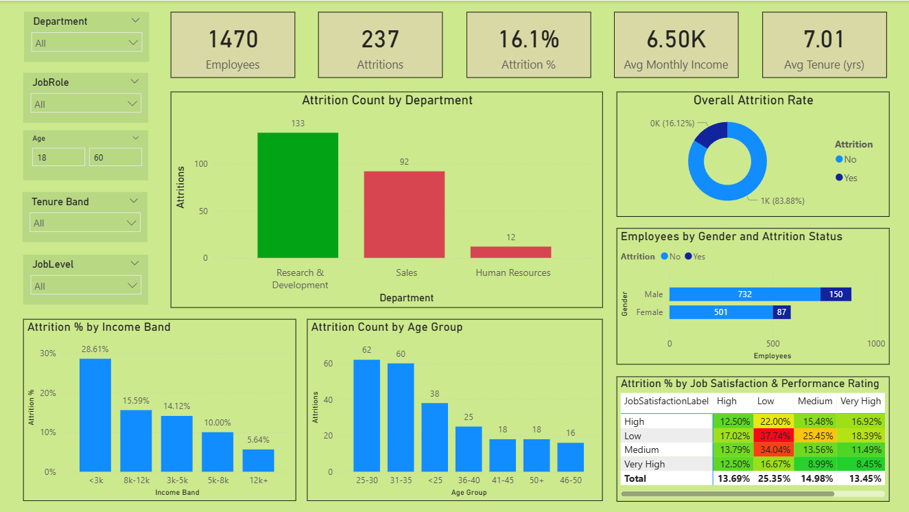

# HR Attrition Analysis using Power BI

## 📌 Project Overview
This project analyzes employee attrition trends using HR data.  
The goal is to identify key factors that contribute to employee turnover and present insights through an interactive Power BI dashboard.  

## 🎯 Objectives
- Measure overall attrition and key workforce KPIs.  
- Identify attrition trends by **department, gender, age group, income band, and tenure**.  
- Explore the impact of job satisfaction and performance on attrition.  
- Provide HR teams with actionable insights for employee retention.  

## 🛠 Tools Used
- **Power BI Desktop**  
- **Excel (Data Source)**  
- **DAX (for custom measures)**  

## 📊 Steps Performed
1. **Data Cleaning & Preparation**  
   - Imported HR dataset into Power BI.  
   - Removed duplicates, handled null values, and standardized columns.  

2. **Data Modeling**  
   - Built relationships between fact and dimension tables.  
   - Created calculated columns (e.g., age group, tenure band, income band).  

3. **DAX Measures**  
   - Total Employees  
   - Attrition Count  
   - Attrition Rate (%)  
   - Average Tenure (Years)  
   - Average Monthly Income  

4. **Dashboard Development**  
   - KPI Cards → Total Employees, Attrition, Attrition %, Avg Tenure, Avg Income.  
   - Donut Chart → Overall Attrition Rate.  
   - Column Charts → Attrition Count by Department and Age Group, and Attrition % by Income Band.  
   - Bar Chart → Employees by Gender and Attrition Status.  
   - Heatmap → Attrition % by Job Satisfaction & Performance.  
   - Slicers → Department, Job Role, Age, Job Level, Tenure Band.  

5. **Insights Generated**  
   - Higher attrition in certain departments (R&D and Sales).  
   - Younger employees (20–30) showed more turnover.  
   - Employees with lower income bands had higher attrition.  
   - Overtime and low job satisfaction correlated strongly with attrition.  

## 📈 Dashboard Preview
    The screenshots of the attrition analysis dashboard are included in the repository.
    

## 🚀 Key Learnings
- Practical application of Power BI visualization and DAX.  
- Hands-on experience with HR analytics and KPI reporting.  
- Demonstrated ability to convert raw HR data into actionable insights.  

---
